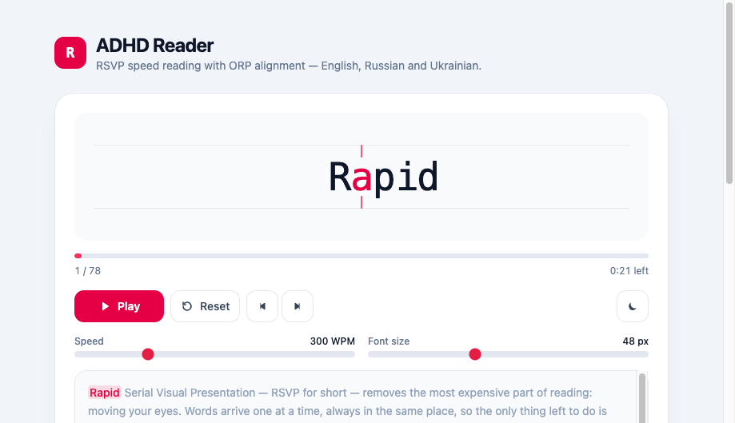
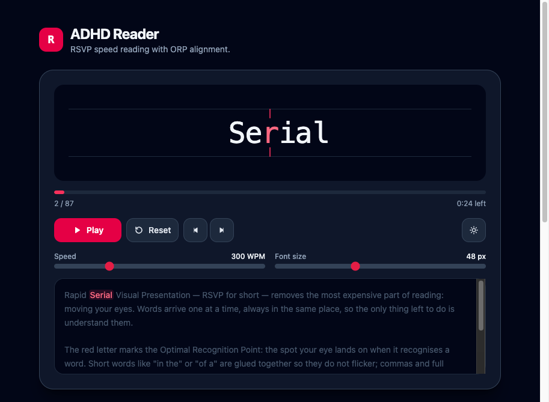

# ADHD Reader

A dependency-free React + TypeScript component for **RSVP** (Rapid Serial Visual Presentation) reading:
words appear one at a time in a fixed spot, so the eyes never travel and there is no line to lose.
Built for readers with ADHD or focus difficulties.



## Highlights

- **ORP alignment.** Every word gets an Optimal Recognition Point; that character is painted red and stays glued to the center of the box between two focus ticks, no matter how long the word is.
- **Rhythm, not a metronome.** Commas, dashes, sentence ends and paragraph breaks each get their own pause; long words get a little extra time.
- **Smart short-word merging.** `in the house` is shown as one frame instead of three, which removes most of the flicker.
- **Automatic language detection** for short-word lists.
- **Full control surface.** Play / Pause / Reset, step by word, WPM slider (100–900), font-size slider, light/dark theme, keyboard shortcuts.
- **No runtime dependencies** beyond React. Styling is Tailwind CSS v4 utility classes.

## Quick start

```bash
npm install
npm run dev      # http://localhost:5173
npm run build    # typecheck + production build
```

## Using the component

The simplest, fully uncontrolled form — the component keeps speed, font size and theme in its own state:

```tsx
import { AdhdReader } from './components/AdhdReader';

export function Article() {
  return <AdhdReader text="Words arrive one at a time, always in the same place." defaultWpm={350} />;
}
```

Controlled form, when the surrounding page owns the settings (this is what the demo in `src/App.tsx` does):

```tsx
const [wpm, setWpm] = useState(300);
const [theme, setTheme] = useState<ReaderTheme>('light');

<AdhdReader
  text={text}
  language="auto"
  wpm={wpm}
  onWpmChange={setWpm}
  theme={theme}
  onThemeChange={setTheme}
  onFinish={() => console.log('done')}
/>;
```

Driving it from outside, through the imperative handle:

```tsx
const reader = useRef<AdhdReaderHandle>(null);

<AdhdReader ref={reader} text={text} showControls={false} />
<button onClick={() => reader.current?.toggle()}>Play / Pause</button>;
```

Or skip the UI entirely and use the engine with your own markup:

```tsx
const { token, isPlaying, progress, play, pause } = useRsvpReader({ text, wpm: 400 });
```

### Props

| Prop | Type | Default | Description |
| --- | --- | --- | --- |
| `text` | `string` | — | Text to read. Changing it rewinds to the first word. |
| `language` | `'auto' \| 'en'` | `'auto'` | Which short-word list to use. `'auto'` detects from the text. |
| `wpm` / `defaultWpm` | `number` | `300` | Reading speed. Changing it never interrupts playback. |
| `fontSize` / `defaultFontSize` | `number` | `48` | Word size in pixels. |
| `theme` / `defaultTheme` | `'light' \| 'dark'` | `'light'` | Adds the `dark` class to the component root. |
| `mergeShortWords` | `boolean` | `true` | Glue short prepositions/conjunctions to the next word. |
| `punctuationPauses` | `boolean` | `true` | Slow down on punctuation and paragraph breaks. |
| `autoPlay` | `boolean` | `false` | Start as soon as the text is loaded. |
| `showControls` | `boolean` | `true` | Render the built-in control panel. |
| `showContext` | `boolean` | `true` | Render the source text with the current word highlighted. |
| `enableKeyboardShortcuts` | `boolean` | `true` | <kbd>Space</kbd> play/pause, <kbd>←</kbd>/<kbd>→</kbd> step, <kbd>R</kbd> reset. |
| `labels` | `Partial<AdhdReaderLabels>` | English | Every UI string, for localization. |
| `onWpmChange`, `onFontSizeChange`, `onThemeChange` | `(value) => void` | — | Change handlers for the controlled props. |
| `onIndexChange` | `(index, total) => void` | — | Fires whenever the displayed frame changes. |
| `onFinish` | `() => void` | — | Fires once after the last frame. |
| `className` | `string` | — | Extra classes on the root element. |

Shortcuts are ignored while the focus is in an input, textarea or contenteditable element.

### Localization

The UI ships with English strings; pass `labels` to translate it:

```tsx
<AdhdReader
  text={text}
  labels={{
    play: 'Start',
    pause: 'Pause',
    reset: 'Reset',
    speed: 'Speed',
    fontSize: 'Font size',
    remaining: (time) => `${time} left`,
  }}
/>
```

## How it works



### ORP — Optimal Recognition Point

The eye does not fixate on the middle of a word but slightly left of it, so the anchor grows in steps
rather than linearly (`utils.ts` → `computeOrpIndex`):

| Letters in the word | 1 | 2–5 | 6–9 | 10–13 | 14+ |
| --- | --- | --- | --- | --- | --- |
| ORP index | 0 | 1 | 2 | 3 | 4 |

Leading punctuation is skipped, so `"Hello` still anchors on the second letter of `Hello`.
The word is laid out in a `1fr auto 1fr` grid, which keeps that one character dead center while the
rest of the word grows to the left and right.

### Pauses

Each frame carries a `delayMultiplier`; the actual delay is `60000 / wpm × delayMultiplier`.
The factors (see `constants.ts`) are multiplied together:

| Cause | Factor |
| --- | --- |
| `.` `!` `?` `…` | ×2.4 |
| `:` `;` `—` `–` | ×1.8 |
| `,` | ×1.5 |
| closing `”` `)` | ×1.2 |
| paragraph break / line break | ×1.6 / ×1.15 |
| every character above 8 | +0.04 (capped at ×1.6) |
| every extra word merged into the frame | +0.15 |

### Short-word merging

A word is merged forward when it is at most 4 characters long, carries no trailing punctuation, and
appears in the language's function-word list. Merging chains (`in` → `in the` → `in the house`) and
stops at 3 words or 14 characters. The ORP is then computed inside the **longest** word of the group,
so the eye lands on `house`, not on the glued `in`.

Inspect the result for any text with the bundled dev script:

```bash
npm run tokens -- "The fox jumps over the lazy dog, and then it sleeps."
```

```
11 words -> 6 frames

The fox
     ^  x1.15
over the lazy
          ^  x1.3
```

## Project structure

```
src/
├── components/AdhdReader/
│   ├── index.tsx              # Component: display, focus ticks, controls, context preview
│   ├── useRsvpReader.ts       # Headless engine: tokens, playback clock, timing math
│   ├── useControllableState.ts# Controlled / uncontrolled prop helper
│   ├── utils.ts               # Tokenizer, ORP, pauses, language detection
│   ├── constants.ts           # Short-word lists, pause factors, slider bounds
│   └── types.ts               # Public types
├── samples.ts                 # Demo text
├── App.tsx                    # Interactive demo page
└── index.css                  # Tailwind entry + class-based dark variant
```

To reuse the reader in another project, copy `src/components/AdhdReader/` — it has no imports outside
of React. If that project does not use Tailwind, replace the class names in `index.tsx`; all the logic
lives in the other files and is style-agnostic.

## License

MIT — see [LICENSE](LICENSE).
